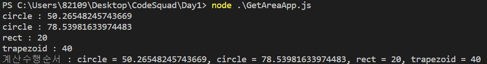

## Day1

---

### [미션] 다각형의 넓이 구하기

1. 다음처럼 동작하는 getArea함수를 만든다.

&nbsp;&nbsp;&nbsp;&nbsp;&nbsp;&nbsp; getArea 함수를 사용하면, 모든 넓이 값을 얻을 수 있다.

```
//getArea('circle', 10);
>  원의 넓이 값출력

//getArea('rect', 10,15);
>  사각형의 넓이값출력

//getArea('trapezoid', 10,15,12);
>  사다리꼴의 넓이값출력

//getArea('circle', 1, n);
> 반지름이 1부터 n까지 1씩 증가하면서, n개까지의 원의 넓이의 모든 합을 출력. 
```
2. printExecutionSequence 함수만들기.

&nbsp;&nbsp;&nbsp;&nbsp;&nbsp;&nbsp; 프로그래밍에서 로깅(logging)은 프로그램의 수행과정이나 결과를 기록하는 것을 말한다.
지금까지 호출된 함수가 무엇인지 알려주는 printExecutionSequence함수를 만들자.
```
getCircle() 
getCircle() 
getArea('circle',2) 
getArea('rect',2,3) 
printExecutionSequence()  //printExecutionSequence가 불려지면, 함수 호출된 순서를 출력한다. 
> 계산수행순서 : circle, circle, circle, rect
```
3. printExecutionSequence 함수 수정

&nbsp;&nbsp;&nbsp;&nbsp;&nbsp;&nbsp; 수행순서 뿐 아니라, 함수의 결과까지 순서대로 같이 출력하는 기능을 만들어보자.

4. debugging 기술문서 정리하기

&nbsp;&nbsp;&nbsp;&nbsp;&nbsp;&nbsp; 실습 이후에, debugging 방법을 markdown문서로 정리하고, github에 이를 정리해서 올린다.

- breakpoints란
- watch사용법
- call stack 의 의미
- Step over / Step into/ Step out

---

### 학습 체크포인트
- Node.js를 통해서 JavaScript개발을 할 수 있다
- 함수의 역할은 한가지에 집중하고 있다.
- 일관된 변수명과 함수이름을 짓고 있다.
- 함수는 늘 동일한 입력값에 동일한 출력을 보장한다.
- 개발과정에서 breakpoint나 'debugger;' 키워드를 사용해서 디버깅을 했다.


---

### 코드

```javascript
var executionSequence = [];

function printExecutionSecuence() {
    var textArr = [];
    executionSequence.forEach(function(elements){
        textArr.push(elements);
    })
    console.log('계산수행순서 : '+textArr.join(', '))
}
function getArea(sort, arg1, arg2, arg3) {
    var result = 0;
    if(sort === 'circle') {
        result = this.getCircle(arg1, arg2);
    } else if (sort === 'rect') {
        result = this.getRectangle(arg1,arg2);
    } else if (sort === 'trapezoid') {
        result = this.getTrapezoid(arg1, arg2, arg3);
    } else {
        result = 'error';
    }
    executionSequence.push(sort+' = '+result);
    console.log(sort+' : '+result);
};
getArea.prototype.getCircle = function(radius, radius2) {
    var sum = radius*radius*Math.PI;
    for(var i=radius+1; i<=radius2; i++) {
        sum += i*i*Math.PI;
    }
    return sum;
};
getArea.prototype.getRectangle = function(base, height) {
    return base*height;
};
getArea.prototype.getTrapezoid = function(base0, base1, height) {
    return base0*base1*height/2;
};

var test0 = new getArea('circle', 4);
var test1 = new getArea('circle', 3, 4);
var test2 = new getArea('rect', 2, 10);
var test3 = new getArea('trapezoid', 2, 4, 10);
printExecutionSecuence();
```

---

### 수행결과


